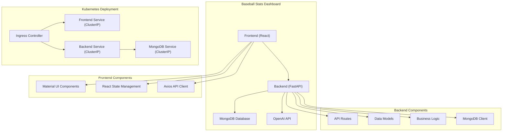
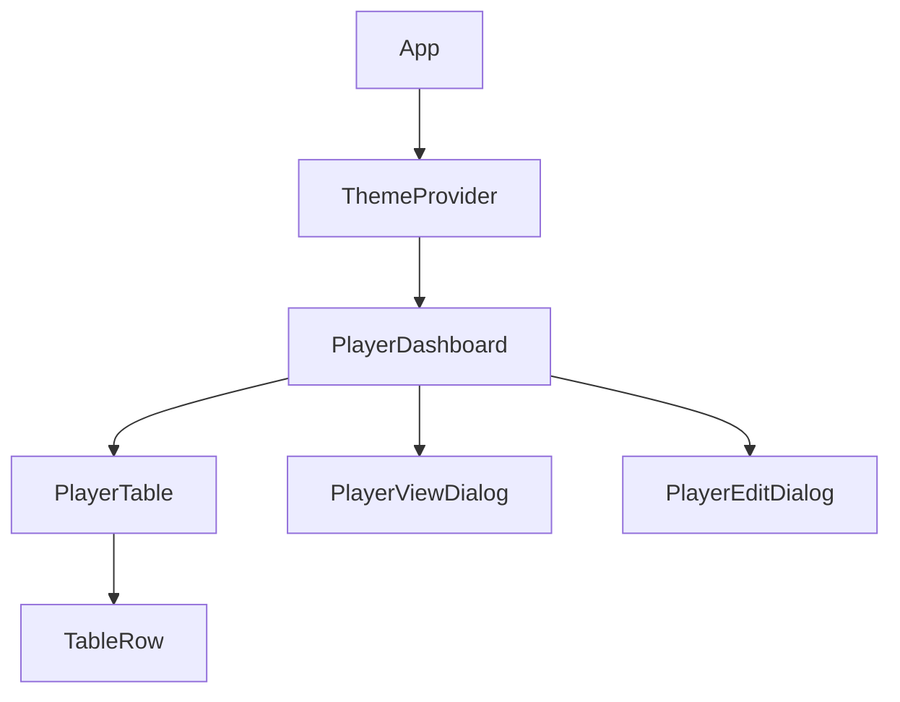
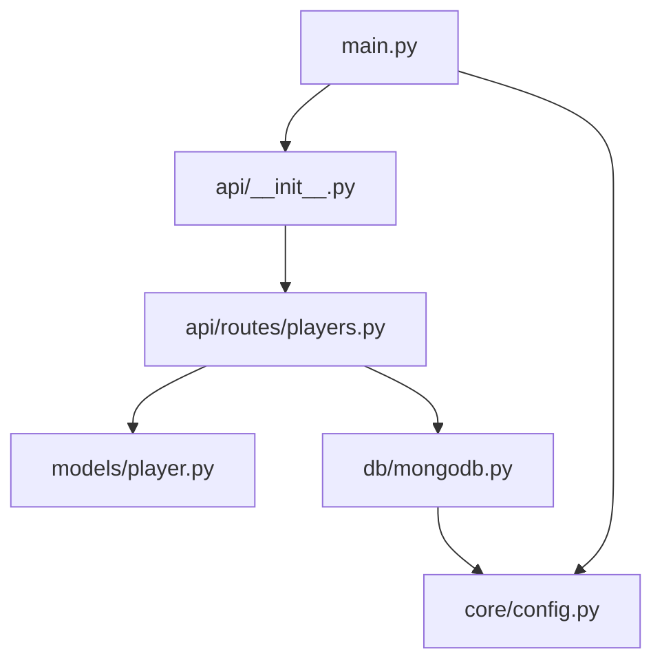

# Baseball Stats Dashboard Architecture

## System Architecture Diagram



## Deployment Architecture

```
┌─────────────────────────────────────────────────────────────────────────┐
│                                                                         │
│                        Kubernetes Cluster                               │
│                                                                         │
├─────────────────────────────────────────────────────────────────────────┤
│                                                                         │
│  ┌────────────────────────────┐         ┌────────────────────────────┐  │
│  │                            │         │                            │  │
│  │   Frontend Deployment      │         │    Backend Deployment      │  │
│  │   (2+ Pods)                │         │    (2+ Pods)               │  │
│  │                            │         │                            │  │
│  └────────────────────────────┘         └────────────────────────────┘  │
│               │                                       │                  │
│               ▼                                       ▼                  │
│  ┌────────────────────────────┐         ┌────────────────────────────┐  │
│  │                            │         │                            │  │
│  │   Frontend Service         │         │    Backend Service         │  │
│  │   (ClusterIP)              │         │    (ClusterIP)             │  │
│  │                            │         │                            │  │
│  └────────────────────────────┘         └────────────────────────────┘  │
│               │                                       │                  │
│               └───────────────┬───────────────────────┘                  │
│                               │                                          │
│                               ▼                                          │
│  ┌────────────────────────────────────────────────────────────────────┐  │
│  │                                                                    │  │
│  │                        Ingress Controller                          │  │
│  │                                                                    │  │
│  └────────────────────────────────────────────────────────────────────┘  │
│                               │                                          │
└───────────────────────────────┼──────────────────────────────────────────┘
                                │
                                ▼
┌───────────────────────────────────────────────────────────────────────────┐
│                                                                           │
│                              External Traffic                             │
│                                                                           │
└───────────────────────────────────────────────────────────────────────────┘
```

## Data Flow Diagram

```
┌────────────────────┐     ┌─────────────────────┐     ┌────────────────────┐
│                    │     │                     │     │                    │
│    User Browser    │◄───►│   React Frontend    │◄───►│   FastAPI Backend  │
│                    │     │                     │     │                    │
└────────────────────┘     └─────────────────────┘     └────────────────────┘
                                                               │
                                                               │
                                                               ▼
                           ┌─────────────────────┐     ┌────────────────────┐
                           │                     │     │                    │
                           │   OpenAI API        │◄───►│   MongoDB          │
                           │                     │     │                    │
                           └─────────────────────┘     └────────────────────┘
```

## Component Diagram

### Frontend Component Hierarchy



### Backend Component Structure


