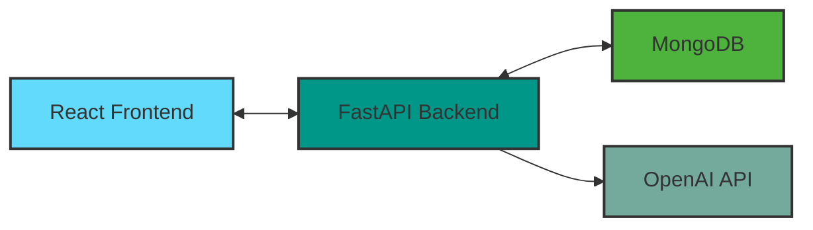
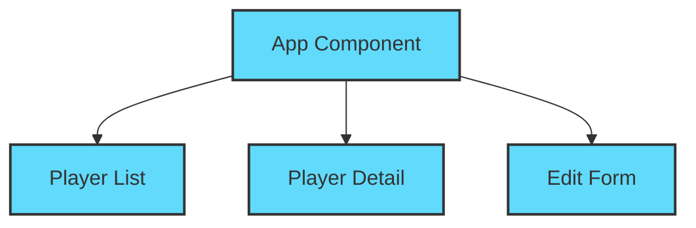
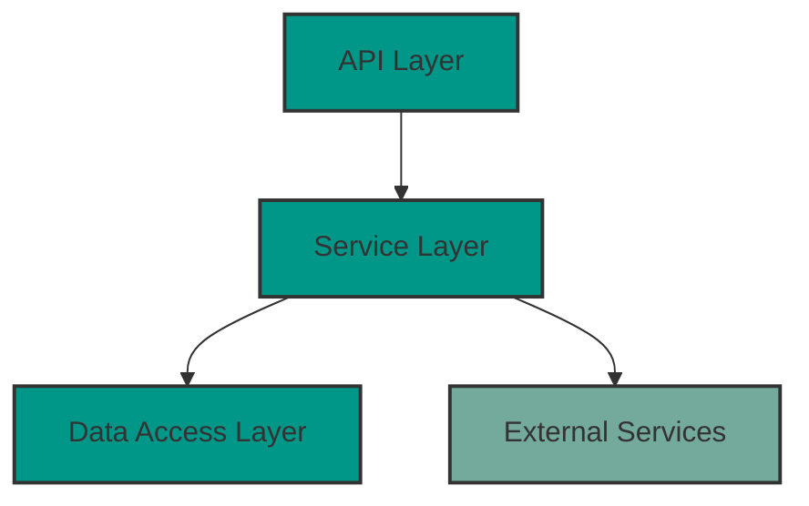

# Baseball Stats Dashboard - Architecture

## System Architecture

The Baseball Stats Dashboard follows a modern microservices architecture with clear separation of concerns:

### Frontend Architecture

The React frontend follows a component-based architecture with hooks for state management:

### Backend Architecture

The FastAPI backend follows a layered architecture with clear separation of concerns:

## Data Flow

1. User requests player data from the frontend
2. Frontend makes API call to the backend
3. Backend retrieves data from the database or external API
4. For player descriptions, backend calls OpenAI API
5. Backend processes and returns data to frontend
6. Frontend renders the data for the user

## Key Design Decisions

### 1. FastAPI for Backend

FastAPI was chosen for its:
- High performance with async support
- Automatic OpenAPI documentation
- Built-in validation with Pydantic
- Type safety with Python type hints

### 2. React with TypeScript

React with TypeScript provides:
- Component reusability
- Type safety for props and state
- Better developer experience with IDE support
- Easier maintenance and refactoring

### 3. MongoDB Database

MongoDB offers:
- Flexible schema for dynamic data
- High performance for large data sets
- Strong indexing capabilities
- Excellent support for real-time updates

### 4. Kubernetes Deployment

Kubernetes deployment enables:
- Scalability for handling traffic spikes
- Self-healing infrastructure
- Declarative configuration
- Easy updates and rollbacks

## Security Considerations

- JWT authentication for API access
- HTTPS for all communications
- Environment-based configuration
- Secrets management in Kubernetes
- Input validation on all endpoints
- CORS configuration for frontend access

## Performance Optimizations

- Database indexing for frequently queried fields
- API response caching where appropriate
- Optimistic UI updates for better user experience
- Lazy loading of components and data
- Pagination for large data sets

## Future Enhancements

- Real-time updates with WebSockets
- Advanced filtering and search capabilities
- User accounts and personalization
- Additional data visualizations
- Mobile application with React Native
